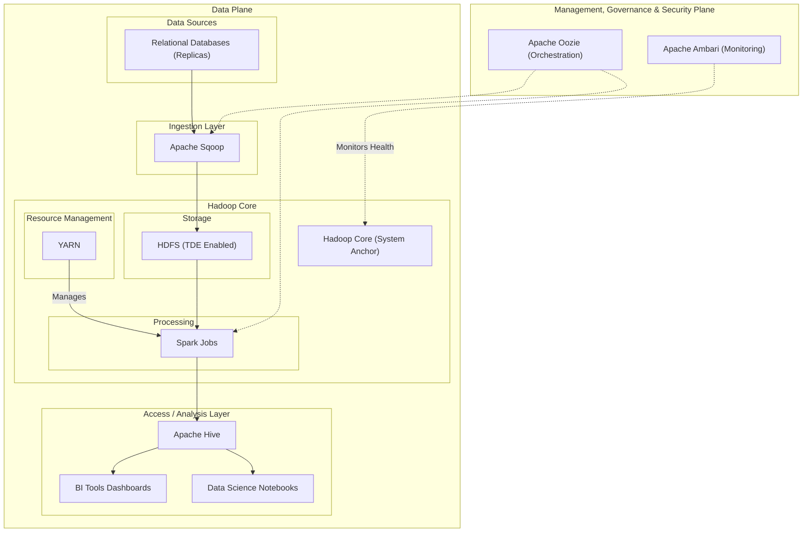

## Introduction

In 2018, a life insurance company was hindered by valuable policy data being locked within siloed, transactional systems. This made comprehensive analytics slow, unreliable, and posed a risk to operational database performance. To address this, we engineered the Policy Analytics Platform, a robust big data solution built on a 100-VM on-premise Hadoop cluster.

The platform was a strategic infrastructure project designed to transform raw policy data from relational databases into a governed, reliable, and accessible corporate asset. By delivering a "single source of truth," the platform unlocked critical business intelligence and data science capabilities, and its design has since been adopted as a reference architecture for subsequent data engineering projects within the organization.

## Business Needs

The Policy Analytics Platform was a strategic infrastructure project initiated in 2018 to address critical challenges in data accessibility and analytics at the life insurance company. The primary business driver was the need to unlock the value of massive volumes of policy data that were siloed within the core transactional Policy Administration System (PAS).

The key objectives were to:

  - Automated Data Pipeline: A fully automated ETL (Extract, Transform, Load) process, orchestrated by Apache Oozie, ran daily. This pipeline performed a bulk ingestion from the PAS into HDFS using Apache Sqoop.

  - Large-Scale Data Transformation: A sequence of **Apache Spark jobs** was responsible for cleansing, validating, de-duplicating, and transforming the raw data into a structured and analysis-ready format.

  - Centralized Data Warehouse: The processed data was organized into a central data warehouse within the Hadoop ecosystem. This included both a detailed, transaction-level data lake and a set of pre-aggregated summary tables (data marts) optimized for high-performance reporting. These data marts were made accessible to analysts through Apache Hive, providing a standard SQL interface.

  - Support for Business Intelligence & Ad-Hoc Analysis: The architecture was designed to support at least 50 concurrent analysts and data scientists, enabling both fast, interactive dashboarding (via the data marts) and deep, complex ad-hoc queries against the full dataset.

Prior to this platform, NCL faced several critical challenges:

  * Slow & Inefficient Reporting: Previously, generating key business reports was a manual, time-consuming process that could take weeks. Analysts would write and run their own complex, long-running queries directly against production database replicas whenever a report was needed. This ad-hoc approach led to two major problems:
      * Inconsistent Results: Different analysts running queries at different times on the "moving target" of a live database would get conflicting numbers.
      * High System Load: The replicas were constantly burdened by unpredictable and inefficient analytical queries, risking performance issues.
  * Data Silos & Lack of Trust: Policy data was fragmented across multiple operational systems. There was no single source of truth, leading to conflicting metrics and a general lack of trust in data-driven insights.
  * Inability to Innovate: The lack of a centralized, clean dataset prevented the data science team from developing advanced analytics, such as churn prediction or customer lifetime value models.
  * Operational Risk: Running complex analytical queries on database replicas posed a performance risk to the customer-facing transactional enrollment applications.

The project focused exclusively on the rich and complex data within the Policy Administration System (PAS), a large-scale Oracle database. We did not include data from CRM, Claim, Actuarial or Billing.

The platform ingested the full scope of policy data, including customer details associated with each policy, coverage information, premium schedules, payment histories, and records of any changes or endorsements over the policy's lifetime.

The initial data load was substantial, encompassing the entire historical record for **over 30 million customers (around 2018)**. This translated into a total raw source data volume of over **50 terabytes** transactional history.

## Key Responsibilities & Contributions

  * Led the design and implementation of the data ingestion pipeline using Apache Sqoop.
  * Engineered the core data processing pipeline, which consisted of approximately 10 **Spark jobs** to transform and aggregate 30 million+ policy records.
  * Played a lead role in the infrastructure team, contributing to the architecture, setup, and maintenance of the 100-VM private cloud environment for the Hadoop ecosystem.
  * Collaborated with business stakeholders to define data model and establish data quality rules.

## Basic Information

  * **Project Name:** Policy Analytics Platform
  * **Domain:** Insurance Policy & Enrollment Analytics
  * **Infrastructure:** On-premise Hadoop cluster running on \~100 VMs

## Tech Stacks & Architecture

### Data Plane (Core Data Flow)

  * **Ingestion:** Apache Sqoop for daily, scheduled bulk imports from relational databases.
  * **Storage:** Hadoop Distributed File System (HDFS) as the primary data lake storage, with HDFS Transparent Data Encryption (TDE) enabled to protect all data at rest.
  * **Processing:** **Apache Spark** for robust, large-scale batch processing.
  * **Resource Management:** YARN to manage cluster compute resources.
  * **Data Access:** Apache Hive to provide a SQL-like interface for analysts.

### Management, Governance & Security Plane

  * **Orchestration & Scheduling**: Apache Oozie was the brain of the pipeline, automating the entire daily workflow by scheduling and coordinating the dependent Sqoop and Spark jobs.
  * **Security & Authorization**: Apache Ranger provided centralized, fine-grained, role-based access control for HDFS and Hive. This ensured users could only access the data they were explicitly permitted to see, meeting strict compliance standards.
  * **Metadata & Governance**: Apache Atlas was integrated to provide a full data catalog, including data discovery, classification, and lineage tracking from source to final report.
  * **Cluster Management & Monitoring**: Apache Ambari was used for comprehensive, real-time monitoring of cluster health, resource utilization, and job performance, with configured alerts for proactive operational support.

#### Tech Stack Diagram:

## Key Challenges & Solutions

  * **Challenge: Infrastructure Complexity:** Building and configuring a 100-VM on-premise Hadoop cluster involved significant hurdles in hardware provisioning, network setup, and cluster security.
      * **Solution:** We successfully navigated the setup and implemented Kerberos for robust authentication, creating a stable and secure environment for data operations.
  * **Challenge: Data Quality and Consistency:** Data from legacy systems was inconsistent, containing formatting errors and missing values that broke analytics.
      * **Solution:** We designed and implemented a multi-stage data validation and cleansing pipeline within our **Spark jobs**, creating a trusted and reliable dataset for downstream consumption.
  * **Challenge: Processing Performance:** A critical daily policy aggregation job initially took over 10 hours to run, failing to meet the business SLA.
      * **Solution:** By optimizing the **Spark job** through techniques like **data partitioning and tuning shuffle operations**, we reduced the execution time by over 60% to under 4 hours.

## Data Scale & Availability

  * **Initial Volume:** \~30 million historical policyholder records.
  * **Ingestion Cadence:** Daily batch ingestion of all new and updated policy data.
  * **Data Latency:** T+2 (data processed and available for querying two days after the transaction date).

## Outcomes & Impact

The Policy Analytics Platform delivered significant, measurable value to the business:

  * **Accelerated Insights:** Reduced the time to generate quarterly enrollment reports from **over one week to under four hours**.
  * **Enabled Advanced Analytics:** Unlocked the ability for the data science team to build the company's **first-ever policy lapse prediction model**, leading to new customer retention strategies.
  * **Established a Single Source of Truth:** The platform was adopted by over 50 analysts across 5 departments as the certified source for all policy data, eliminating reporting discrepancies.
  * **Set an Organizational Standard:** The platform's ingestion and data quality framework was formalized as a **reference architecture**, saving an estimated **4 months of development time** on the subsequent Claims Analytics Platform project.